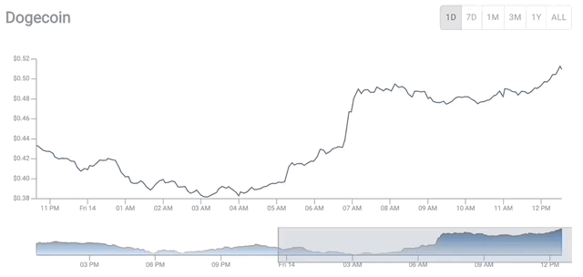

Recently, I visit a crypto tracker [site](https://coinmarketcap.com/currencies/bitcoin/) to check DogeCoin prices to see whether it going to the moon 🚀

I was curious about how to build a simplified version on that site using React, other libraries, and tools out there.

So I did research to find which API to use and came across a free, reliable, and comprehensive API from the team 🦎[CoinGecko](https://www.coingecko.com/en/api).

At the same time, my goal also was to focus to find a low-level visualization tool that comprises the power of using D3 with React, flexibility, optimized speed, and bundle sizes. And I came across [Visx](https://airbnb.io/visx/) from Airbnb.

Some of the features that I had in mind are,

- Listing all supported coins price, market cap, and volume and market-related data.
- Display coin prices in a chart with a time filter and brushing capability to select a time range.

For this project, I will be using,

- reactjs with typescript
- visx for visualization
- styled-component for styling
- coingecko api
- material-ui for ui components.
- and other libraries.

Check out my blog on how i build this project https://dev.to/ayeprahman/how-i-build-crypto-tracker-chart-with-react-4k9h

# Getting Started with Create React App

This project was bootstrapped with [Create React App](https://github.com/facebook/create-react-app).

## Available Scripts

In the project directory, you can run:

### `npm start`

Runs the app in the development mode.\
Open [http://localhost:3000](http://localhost:3000) to view it in the browser.

The page will reload if you make edits.\
You will also see any lint errors in the console.

### `npm test`

Launches the test runner in the interactive watch mode.\
See the section about [running tests](https://facebook.github.io/create-react-app/docs/running-tests) for more information.

### `npm run build`

Builds the app for production to the `build` folder.\
It correctly bundles React in production mode and optimizes the build for the best performance.

The build is minified and the filenames include the hashes.\
Your app is ready to be deployed!

See the section about [deployment](https://facebook.github.io/create-react-app/docs/deployment) for more information.

### `npm run eject`

**Note: this is a one-way operation. Once you `eject`, you can’t go back!**

If you aren’t satisfied with the build tool and configuration choices, you can `eject` at any time. This command will remove the single build dependency from your project.

Instead, it will copy all the configuration files and the transitive dependencies (webpack, Babel, ESLint, etc) right into your project so you have full control over them. All of the commands except `eject` will still work, but they will point to the copied scripts so you can tweak them. At this point you’re on your own.

You don’t have to ever use `eject`. The curated feature set is suitable for small and middle deployments, and you shouldn’t feel obligated to use this feature. However we understand that this tool wouldn’t be useful if you couldn’t customize it when you are ready for it.

## Learn More

You can learn more in the [Create React App documentation](https://facebook.github.io/create-react-app/docs/getting-started).

To learn React, check out the [React documentation](https://reactjs.org/).

# react-crypto-tracker
